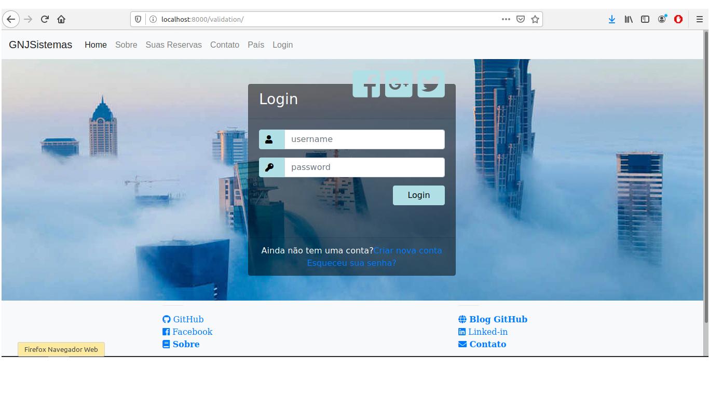

# hotel_booking_system
System by hotel booking with python, in construction.

This project as removed file hotel_booking/hotel_booking/settings.py, bcause informations contants in file. But install and init new project has is file and add configurations with server and client add in INSTALLED_APPS 

```py
INSTALLED_APPS = [
    'django.contrib.admin',
    'django.contrib.auth',
    'django.contrib.contenttypes',
    'django.contrib.sessions',
    'django.contrib.messages',
    'django.contrib.staticfiles',
    'server',
    'client',
]
```



